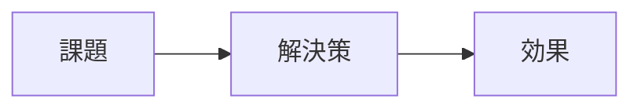

# ppt-creator

Marp + FJ Marp テーマ + Python で、**そのまま配布できる品質**のスライドを生成する。
スクリプトはプロジェクトルートから `PYTHONPATH=skills/ppt-creator` を付けて実行し、成果物はプロジェクトの `output/` に出力する。

## Philosophy

- **Marp 専用 / FJ テーマ固定**。テーマは 1920×1080・92px パディングの `fj` 1 種類のみ。テーマを選ぶ代わりに、FJ の豊富なレイアウトクラスを使いこなす方針。
- **スキャフォールドは最小**。`new_deck.py` が表紙 + 本文 1 枚 + クロージングの 3 枚を生成するだけ。構成は `references/sample-slide.md` と `references/layouts.md` を参照しながら都度組み立てる。
- **アクションタイトル必須**: 見出しにはトピックラベル (「コスト分析」) ではなく結論 (「ツール A は 3 年 TCO で 30% 有利」) を書く。タイトルを順に追うだけで全体のストーリーが伝わる状態を目指す。
- **1 スライド 1 メッセージ**。伝えたいことが 2 つあるなら 2 枚に分ける。
- **フレームワーク駆動**。まず構造 (SCQA / Pyramid / MECE) を決め、次にコンテンツ、最後にレイアウト。
- **表現手段を惜しまない**。Mermaid、コードブロック、テーブル、blockquote、`column-layout`、画像を適材適所で使う。テキストだけで埋めない。
- **品質はスクリプトで担保**。`lint_deck.py` で機械的にチェックし、目視は最終確認に集中させる。

---

## Workflow

### Step 1: 意図確認 (必ず実施 / **AskUserQuestion ツールで選択式**に聞く)

スライド作成に着手する前に、下記項目をユーザーに確認する。**質問は必ず `AskUserQuestion` ツールで出すこと** — テキストで A/B/C を並べた長文質問にしない。ユーザーは矢印 + Enter で選べるので、文字入力の負担がなく即答できる。なぜツールを使うかというと: (1) ユーザーが設問を読んで番号を打ち込む負担をなくす、(2) 質問が多いと負担が増えるので強制的に 4 問以内に絞らせる、(3) Claude 側も選択肢を整理することで推測空間を明示できる。

**やり方**:
- `AskUserQuestion` ツールを呼ぶ。1 回のツール呼び出しで最大 4 問まで。各問は 2〜4 択。
- 推奨案は選択肢の先頭に置き、label に「(Recommended)」を付ける。
- 選択肢は題材から具体的に導く (抽象的な「中立」「簡潔」ではなく、「事実ベース・中立（技術選定向け）」のように題材に即した文言)。
- **質問は必要最小限に絞る**。4 問を埋めるために質問を水増ししない。題材から既に推測できるものは Claude 側で決めて、判断が割れそうな 2〜4 問だけ聞く。
- ツールは自動で「その他（自由記述）」を末尾に付けてくれるので、明示的に「その他」を選択肢に入れない。
- 1 回で足りなければ、最初の回答を受けてから 2 回目の `AskUserQuestion` を追加で呼ぶ。ただし合計でも 6〜8 問を超えないようにする。

**優先順位** (どれを聞くか迷ったらこの順):

1. **audience** — 誰に見せるか。ほぼ必ず聞く。
2. **purpose / takeaway** — 何を決めさせたいか。ほぼ必ず聞く。
3. **pages** — 枚数レンジ。題材で想像がつく場合は推測で進めてもよい。
4. **tone** — 中立か説得寄りか。purpose でほぼ決まるなら省略可。
5. **構成パターン (SCQA / MECE / Pyramid)** — 題材が比較系なら MECE で固定してよい。
6. **ドメイン固有項目** — 比較対象・評価軸・自社規模など。題材に応じて追加。

**禁則**:
- テキストで A/B/C を箇条書きした長文質問を投げる (ユーザーが番号を打つ必要が出る)
- 純粋な open question (「〜を教えてください」) を並べる
- 1 ターンで 10 問以上の質問を並べる (認知負荷が過大)
- ツールに「その他」「自由記述」を明示的に選択肢として入れる (ツールが自動で付ける)

テーマは `fj` 固定なので確認不要。

### Step 2: スキャフォールド生成 & 構成パターン選択

最小スキャフォールド (表紙 + 本文 1 枚 + クロージング) と作業ディレクトリを生成する:

```bash
# プロジェクトルートで実行
PYTHONPATH=skills/ppt-creator uv run python -m scripts.new_deck my-deck \
  --output-dir /absolute/path/to/project/output
```

次に題材に合う**構成パターン**を選ぶ。これは固定テンプレートではなくアウトライン骨格の目安:

| シナリオ | 構成 | 枚数目安 |
|----------|------|----------|
| 提案資料 (営業・企画) | SCQA: 表紙 → Situation → Complication → Question → Answer → 実行計画 → Next Steps | 10〜14 |
| 役員報告 / 経営決裁 | Pyramid: 表紙 → 結論 → 根拠 3 本 → 詳細 → 決裁依頼 | 5〜7 |
| ツール / 手法比較 | MECE: 表紙 → 評価軸定義 → 候補一覧 → 評価マトリクス → 候補別詳細 → 推奨 | 8〜12 |
| 技術 LT / 勉強会 | TL;DR → 背景 → アーキ → Before/After → ベンチ → まとめ | 8〜12 |
| 進捗報告 | 表紙 → サマリ → 実績 → 課題 → リスク → 次アクション | 5〜8 |

詳細な構成例とフレームワーク解説 → `references/consulting-frameworks.md`

### Step 3: アウトライン作成 → 承認

Step 2 の構成パターンを叩き台に、ユーザーの題材に合わせてスライド順とレイアウトを決める。
以下のようなアウトラインを提示し承認を得る (承認後に Step 4 に進む):

```
 1. [title]                表紙
 2. [通常]                 アジェンダ
 3. [section]              Situation (背景)
 4. [content-image-right]  市場背景 + graph TD
 5. [通常 / column-layout] 現状 KPI 3 列
 6. [section]              Complication (課題)
 7. [content-image-left]   課題 + 画像
 8. [通常]                 顧客の声 (blockquote) + テーブル
 9. [section]              Answer
10. [align-center]         結論 (大きな **強調**)
11. [通常]                 実行計画 (Mermaid Gantt)
12. [通常 / small-text]    Next Steps
```

### Step 4: Markdown 執筆

`deck.md` のスキャフォールドを起点に、Step 3 で合意したアウトライン順でスライドを追記していく。
プレースホルダ (`{{...}}`, `TODO`, `FIXME`, `【要書換】`) が残っていると lint で ERROR になる。

守るべきルール:
- アクションタイトルで見出しを書く (トピックラベル禁止)
- 1 スライド 1 メッセージ
- `<!-- _class: xxx -->` でレイアウトを指定 (FJ クラスの allowlist は下記)
- Content Limits を守る (後述)
- 見出し内の `**強調**` は FJ テーマが自動で青にしてくれる — 使い分けると強調に統一感が出る
  - **CJK 約物の罠**: `**「長文」**の三拍子` のように `**` の閉じ側が `」』）、。` 等の和文約物に挟まれると、CommonMark の right-flanking ルールで `**` が閉じず、リテラル `**` が表示されてしまう。回避策は **`**` を約物の内側に置く**: `「**長文**」の三拍子` と書く。lint がこのパターンを WARNING で検出する
- 図が欲しい箇所は **まず Mermaid で書く**。PPTX/PDF ビルド時は `build.py` が自動的に PNG 化して埋め込む (要 `mmdc`)

#### 画像レイアウトの判定 (横長 vs 縦長)

**横長画像を `content-image-right` / `content-image-left` に入れてはいけない。** 横長画像が左右サイドパネルに押し込まれると、パネル幅に合わせて縮小され極端に小さく潰れる。これは最も頻出する視覚事故であり、厳守すること。

判定基準:

| 画像の向き | 使うクラス | 絶対に使ってはいけないクラス |
|-----------|-----------|------------------------|
| **横長** (width > height) | `content-image` (縦積み) | `content-image-right` / `content-image-left` |
| **縦長〜正方形** (height >= width) | `content-image-right` / `content-image-left` | — |

**Mermaid 記法からの判定** — Mermaid のコードを書いた時点でレイアウトが決まる:

| 横長になる Mermaid 記法 → `content-image` | 縦長になる Mermaid 記法 → `content-image-right/-left` |
|----------------------------------------|--------------------------------------------------|
| `graph LR` / `flowchart LR` | `graph TD` / `flowchart TD` |
| `gantt` | `graph TB` / `flowchart TB` |
| `timeline` | `sequenceDiagram` (参加者が少ない場合) |
| `journey` | `classDiagram` |
| `sequenceDiagram` (参加者が多い場合) | `stateDiagram` |
| `gitgraph` | `erDiagram` |

**迷ったら `content-image` (縦積み) を選ぶ。** 縦積みなら横幅フルに使えるため、どちらの向きでも潰れない。`content-image-right/-left` は縦長画像のときだけ選択する。

- **タイトルスライドは最小限**: `# 見出し` + 日付 + 発表者名のみ。「パートナー企業向け」「内部資料」「営業戦略」のような対象読者・用途の修飾は表紙に書かない。同種の情報はフロントマターの `header:` / `footer:` に入れて全スライド共通の小帯として出す。表紙はメッセージとブランドだけで勝負する
- **アジェンダスライドは短く**: 「本日お伝えすること」「アジェンダ」「目次」のような俯瞰スライドの箇条書きは **15 字程度の名詞句** に抑える。文章で書きたくなったら、それは概要スライドではなく本文スライドの内容。lint が長すぎる agenda 箇条書きを WARNING で検出する

#### キーメッセージ (全本文スライド必須)

**`title` / `section` / `align-center` 以外のすべてのスライドに、h1 の直下にキーメッセージを 1 文で必ず書く。** これはスライドデザインの中核ルールであり、省略してはいけない。h1 はヘッダーバーに吸い上げられて視認性が下がるため、本文領域の冒頭に「このスライドが何を伝えたいか」を端的に示す 1 文が無いと聴衆はスライドの意図を掴めない。

キーメッセージは h1 タイトルの繰り返しではなく、**根拠要約・読み方のガイド・結論のエッセンス**を述べる。長さは 40〜80 字の 1 文。2 文以上になったらスライドを分けるサイン。

FJ テーマは `<p>` が本文要素 (`<ul>`, `<ol>`, `<table>`, `<blockquote>`, `<pre>`, `.column-layout`, `.card-grid`) の直前にあるとき、自動で h1 直下 (y=124, 32px = PPTX 24pt 相当) に絶対配置する。したがって **キーメッセージは必ず h1 と本文コンテンツの間に書く** (テーブルやリストの後ろに置いても CSS は効かない)。

```markdown
<!-- ✅ 正しい: h1 → キーメッセージ → 本文 -->
# SmartHR は労務クラウド 7 年連続シェア No.1

労務の完成度と連携エコシステムで他 3 社を引き離し、当社規模にも適合する。

- 登録社数 70,000 社超、継続率 99%
- ...

<!-- ❌ NG: h1 → 本文 → キーメッセージ (CSS が効かず段落が本文に埋もれる) -->
# SmartHR は労務クラウド 7 年連続シェア No.1

- 登録社数 70,000 社超、継続率 99%
- ...

労務の完成度と連携エコシステムで他 3 社を引き離す。
```

以下は例外 (キーメッセージ不要):
- `title` スライド (表紙)
- `section` スライド (章扉)
- `align-center all-text-center` (結論の強調 — スライド全体が 1 メッセージ)

#### 出典の書き方 (`<cite>` 必須)

出典はスライド本文にインラインで書かず、`<cite>` 要素で記載する。FJ テーマが右下 (フッター・ページ番号と被らない位置) に小さなグレー文字で自動配置する。

```markdown
<!-- ✅ 正しい -->
<cite>出典: ミック経済研究所「HRTech クラウド市場の実態と展望 2024 年度版」</cite>

<!-- ❌ NG: インライン斜体 → 本文ノイズ -->
*出典: ミック経済研究所「HRTech クラウド市場の実態と展望 2024 年度版」*

<!-- ❌ NG: HTML コメント → 何もレンダリングされない (見えない出典は無意味) -->
<!-- 出典: ミック経済研究所... -->

<!-- ❌ NG: column-layout の div 内に出典 → カラム内に表示されてしまう -->
<div class="column">
*出典: ...*
</div>
```

`<cite>` は `<div>` の外に置く。`column-layout` や `card-grid` では `</div>` の後ろ、スライド末尾に書く。lint が `*出典` / `<!-- 出典` パターンを WARNING で検出する。
- **ブランド要素はテーマが自動配置**: 表紙 (`title`) には福岡地所フルロゴ、通常スライド右上には F.J マーク、右下にはページ番号が自動で入る。章扉 (`section`) ではすべて非表示。手動で画像を貼る必要はない
- **デッキ全体の下帯テキスト**: フロントマターの `footer:` ディレクティブで全スライド共通の小さなテキスト (資料タイトルなど) を設定できる。表紙と章扉では自動で非表示になる
  - **`header:` は使わない** — 上部 80px は h1 ヘッダーバー + 右上の F.J マークに占有されており、ここにテキストを重ねると必ず衝突する。テーマ側で `header:` は非表示にしてある。**対象読者・資料 ID・日付のような補助メタは `footer:` に書く**
  - `footer:` は**資料タイトル程度の短い文字列** に留める。社内メモ的な「社内資料」「出典は最終ページ参照」のような説明文を並べない
  ```yaml
  footer: "Anthropic 会社説明資料"
  ```

### Step 5: Lint

```bash
PYTHONPATH=skills/ppt-creator uv run python -m scripts.lint_deck /absolute/path/to/project/output/my-deck/deck.md
```

ERROR は必ず修正。代表例:
- 未解決のプレースホルダ (`{{...}}`, `TODO`, `FIXME`, `【要書換】`)
- `frontmatter` 関連 (marp: true / theme / paginate の欠落)

WARNING もできる限り対処。代表例:
- 箇条書き 10 個以上、本文 18 行以上、総量 750 文字超
- 見出しの長さ超過、FJ allowlist 外のクラス名 (typo の可能性)
- 同一 `_class:` が 3 回連続

### Step 6: Build

`--format` は複数指定できる。**HTML と PPTX を 1 コマンドで同時生成する**のが標準フロー — HTML はブラウザ目視 (Step 7) 用、PPTX は配布用。

```bash
# HTML + PPTX を同時に生成 (推奨)
PYTHONPATH=skills/ppt-creator uv run python -m scripts.build \
  /path/to/output/my-deck/deck.md --format html pptx --with-mermaid

# 単一フォーマットだけ欲しい場合
PYTHONPATH=skills/ppt-creator uv run python -m scripts.build \
  /path/to/output/my-deck/deck.md --format html --with-mermaid
```

- Marp CLI 自体は 1 コマンド 1 フォーマットしか出せないので、`build.py` が指定された各フォーマットを順に呼び出す
- PDF/PPTX/PNG では `--allow-local-files` を自動付与する (バンドル済みロゴ PNG を埋め込むため)
- `marp` CLI が無い環境では自動的に `npx @marp-team/marp-cli` にフォールバックする
- **全フォーマットで `build.py` がデッキ内の Mermaid ブロックを自動で PNG 化** する (HTML / PDF / PPTX / PNG すべて同一画像を使用)。`assets/mermaid-*.png` に書き出し、Markdown を `` に書き換える (幅ディレクティブは付けず、サイズは CSS がレイアウトに応じて自動調整: 通常スライドでは `min(1100px, 95%)` に拡大、`content-image-right/left` のサイドパネル内ではパネル幅にフィット)。元ファイルは `deck.md.bak` にバックアップ。`mmdc` が無いと ERROR で止まるので `npm install -g @mermaid-js/mermaid-cli` を案内する
- ブラウザ側で Mermaid を JS レンダリングしたい場合のみ `--with-mermaid` を付ける (HTML のみ有効、`mmdc` 不要)
- 手動で画像化したい場合は `python -m scripts.generate_images deck.md` を直接呼べる

### Step 7: 成果物の目視確認 (必ず実施)

Build が通っただけでは完成ではない。**必ず生成物を 1 枚ずつ目で見て、違和感がないかを確認する**。Lint はテキスト上の規約違反しか検出できず、画像の潰れ・ヘッダー侵食・余白の偏り・テキストのはみ出しといった視覚的な事故は lint を通り抜ける。

#### 7-1. 生成された成果物を開く

- HTML: `dist/<name>.html` をブラウザで開いて全スライドをスクロール
- PDF/PPTX を出した場合は併せて開く (特に Mermaid を画像化しているので PPTX の見え方は HTML と微妙に異なる)
- ファイルが手元で直接開けない環境なら、PDF を `pdftoppm` で PNG 化して Read tool で 1 枚ずつ視認する:
  ```bash
  pdftoppm -png -r 120 /path/to/output/<name>/dist/deck.pdf /tmp/<name>-page
  ```

#### 7-2. 各スライドで「違和感」を自問する

スライドを順に見ながら、次のチェックに 1 つでも引っかかったら「違和感あり」として修正対象に入れる。引っかからなければ次のスライドへ。

- [ ] **テキストが画像やヘッダーバーと重なっていないか** (特に `content-image-right/-left` の縦長画像 / 大きな Mermaid)
- [ ] **画像がスライド枠からはみ出したり、極端に小さく潰れたりしていないか** (横長画像を左右パネルに押し込むと起こる)
- [ ] **上部 h1 ヘッダーバー (80px 帯) に本文要素が食い込んでいないか**
- [ ] **左右・上下の余白が極端に偏っていないか** (カード列の高さがバラバラ等)
- [ ] **タイトルが聴衆にとって意味を持つ一文になっているか** (トピックラベルで止まっていないか)
- [ ] **1 スライドに論点が 2 つ以上詰まっていないか**
- [ ] **デッキ全体としてスカスカに見えるスライドが混じっていないか** (上限の余裕を数値・根拠で埋める余地があるか)
- [ ] **`**強調**` マーカーがそのままリテラルで表示されていないか** (CJK 約物に挟まれた閉じタグの事故)
- [ ] **表紙・章扉で footer/ロゴが二重に出ていないか**

#### 7-3. 違和感があれば deck.md を直す

違和感を見つけたら、**deck.md を編集して解消する**。典型的な直し方:
- テキストが画像と重なる / ヘッダーバーに侵食する → 画像の縦横比に合ったクラスに変える (縦長なら `content-image-right/-left`、横長なら `content-image`)、あるいは画像と bullets を別スライドに分ける
- スカスカ / 情報薄 → 数値・比較・出典を足す
- トピックラベル見出し → 結論の一文に書き換える
- カード高さがバラバラ → `column-layout` を `card-grid` に置き換える
- `**強調**` がリテラル表示 → `**` を CJK 約物の内側に移す

直したら再 lint・再 build して違和感が解消したかを確認する。違和感がなくなれば完了。

**スキル本体 (`fj.css` / `lint_deck.py` / SKILL.md / references) を触るのはスキル保守者がデバッグしているときだけ**。通常のスライド作成ジョブではスキルファイルを書き換えてはいけない。再発しそうなバグを見つけたらユーザーに報告して、スキル側での修正はユーザー判断に委ねる。

`references/quality-checklist.md` は Before/After の判断材料として任意で参照してよい (採点は必須ではない)。

```
┌─────────┐    ┌─────────────┐    ┌──────────────┐
│ Build   │───▶│ 1枚ずつ目視  │───▶│ 違和感あり?  │
└─────────┘    └─────────────┘    └──────┬───────┘
                                          │
                                 Yes ◀────┘────▶ No → 完了
                                  │
                          ┌───────▼────────┐
                          │ スキル側を修正 │
                          │ → 再 Lint/Build│
                          └────────────────┘
```

---

## アクションタイトル

全スライドの見出しはトピックラベルではなく**結論**を書く。これが本スキルで最も重要な運用ルール。

| NG (トピックラベル) | OK (アクションタイトル) |
|---------------------|------------------------|
| 市場分析 | 国内 SaaS 市場は年率 15% で拡大している |
| コスト比較 | ツール A は B より初期費用が 40% 低い |
| 課題 | 現行システムの保守コストが利益を圧迫している |
| 提案 | 段階的移行で年間 2,000 万円の削減が可能 |
| スケジュール | 3 フェーズ 16 週で本番稼働を目指す |

フレームワーク (SCQA / Pyramid / MECE) の詳細な解説とスライド順の例 → `references/consulting-frameworks.md`

---

## Layout (FJ クラス語彙)

`<!-- _class: ... -->` でスライドごとに適用する。複数クラスは空白区切り。

| Class | 用途 |
|-------|------|
| `title` | 表紙 (`<!-- _paginate: false -->` と併用) |
| `section` | 中扉・章区切り |
| (指定なし) | 通常スライド (h1 がヘッダーバーになる) |
| `image` / `image image-shadow` | 画像主役 |
| `content-image` | タイトル→テキスト→画像の**縦積み**。**横長画像** (timeline / gantt / ロードマップ) はこちら |
| `content-image-right` + `content-30/40/60/70/80` | 右に画像 + 左にテキスト (テキスト幅を 30〜80% で指定)。**バランス型・縦長画像**向け |
| `content-image-left` + `content-30/40/60/70/80` | 左に画像 + 右にテキスト |
| `column-layout` + `<div class="column">` | 2〜3 カラム (各カラムが縦に伸縮、テキスト主体の比較に向く) |
| `card-grid` (+ `cols-3` / `cols-4`) + `<div class="card">` | **4〜8 個の同格カードを等幅・等高で並べる**。「6本柱の事業領域」「主要 KPI 4 つ」のような並列要素に最適。CSS Grid で行高も揃うので column-layout のようにバランス崩れしない。デフォルト 2 列、`cols-3` で 3 列、`cols-4` で 4 列。**`cols-4` は 1 カードあたり幅が狭いので中身は短いキーワード・KPI 数値に限定する** (長文の bullets は `cols-3` に落とすか、2 枚に分ける) |
| `align-center` / `all-text-center` | クロージング、結論の強調 |
| `small-text` | 情報密度が高いスライド (全体を 20% 縮小) |
| `text-blue` / `text-red` / `all-text-blue` / `all-text-red` | 強調色 (見出し内の `**強調**` は自動で青) |
| `no-header` | ヘッダー非表示 (フルスクリーン) |

**レイアウト多様性**: 同じクラスを 3 回以上連続で使わない (lint で検出)。

**移行ガイド (参考)**: 以前の世代で `grid-2/3`, `kpi`, `vs`, `quote` といったクラスを使っていたデッキから置き換える場合のマッピング。**これらの旧クラスは fj.css に存在しないので書いても効かない**。新規デッキでは必ず下の右側 (FJ 語彙) を使う。
- `grid-2/3` → 4 個以上で同格なら `card-grid`、テキスト比較中心なら `column-layout`
- `kpi` → `card-grid cols-3` (3 つ並び) または `cols-2` (4 つ並び) の各カードに `# 大きな数字` + 小さいラベル。4 列にはしない
- `vs` → `column-layout` 2 列 or 比較テーブル
- `quote` → blockquote or `align-center all-text-center` + 大きなテキスト

**`column-layout` と `card-grid` の使い分け** — 過去に「6 個のカードを `column-layout` 3 列 × 各列 2 カード」で作って高さがバラバラになる事故があった。**4 個以上の同格項目を並べたいときは必ず `card-grid` を使う**。column-layout は 2-3 列で各カラムが「文章のまとまり」を持つ場合 (左に現状、右に提案など) に限定する。

**画像+テキストを 1 スライドに同居させたいときは画像の縦横比で使い分ける**。デフォルトレイアウトで画像と箇条書きを混ぜると、画像が縦方向を圧迫して bullets を押し出したり h1 ヘッダーバーを侵食したりする事故が繰り返し発生した。lint は `![img]` + bullets の混在をデフォルトレイアウトで検出して WARNING を出す。

| 画像の形 | 使うクラス | 理由 |
|---------|-----------|------|
| **縦長〜正方形** (アーキ図 / サイドバイサイド / 縦フロー / ポートレート) | `content-image-right` または `content-image-left` + `content-30/40/60/70/80` | 画像を左右のサイドパネルに閉じ込めてテキストと並列配置。縦長画像なら潰れずに入る |
| **横長** (timeline / gantt / 横長フローチャート / ランドスケープ) | `content-image` (縦積み: title → text → image) | 横長画像を左右パネルに押し込むと潰れるため NG。上下に積んで横幅フルに使う |
| 画像のみ (説明文なし) | 指定なし (デフォルトレイアウト) | solo-image として自動で中央拡大される |

Mermaid 図も同じ判断基準で使い分ける: `graph TD` (縦方向) → `content-image-right`、`graph LR` / `gantt` (横方向) → `content-image`。生成済み PNG の縦横を確認してから class を選ぶこと。

```markdown
<!-- 縦長画像の例 -->
<!-- _class: content-image-right content-60 -->
# **結論**を見出しに書く
- テキスト bullet 1
- bullet 2


```

```markdown
<!-- 横長画像の例 -->
<!-- _class: content-image -->
# **ロードマップ** を 3 フェーズで実行

- 説明文 bullet 1
- bullet 2


```

```markdown
<!-- _class: card-grid cols-3 -->
# 6つの事業領域でまちの暮らしを支える

<div class="card">

## オフィス事業
天神・博多でシェア **10%超**

</div>
<div class="card">

## 商業事業
キャナルシティ博多など **九州最大級**

</div>
<!-- ... 残り 4 カード ... -->
```

全クラス実演デッキ → `references/sample-slide.md`
コンサル風スニペット集 + 画像サイズ目安 → `references/layouts.md`

---

## Mermaid / コードブロック / 画像

### Mermaid
見出し付きで直接埋め込める。HTML ビルドに `--with-mermaid` を付けるとブラウザで描画される。

````markdown

````

PPTX でも画像として出したい場合は `scripts.generate_images` を通す。

### コードブロック
FJ テーマが自動でフォントサイズを調整してくれる。`ts`, `py`, `bash`, `sql` などの言語指定を付ける。

### 画像
Marp の拡張記法でサイズ・配置を制御できる。詳細 → `references/marp-advanced.md`。

```markdown


```

プレースホルダ URL として `https://placehold.jp/...` を使えばそのままビルド可能。

詳細 → `references/images-and-diagrams.md`

---

## Content Limits (1920×1080 前提)

| 要素 | 上限 |
|------|------|
| アクションタイトル | 66 文字 (JA) / 84 文字 (EN) ※ `**強調**` マーカーは除外してカウント |
| 箇条書き数 | 9 個 / スライド (`small-text` は ×1.5、`column-layout` / `card-grid` は ×カラム/カード数) |
| 箇条書き 1 行 | 120 文字 (visual width、`small-text` は ×2.0) |
| 本文行数 | 18 行 / スライド (`small-text` は ×1.5) |
| 総コンテンツ量 | 750 文字 / スライド (`small-text` は ×2.0) |
| 同一レイアウト連続 | 2 回まで |
| `card-grid` 最大カード数 | cols-2: 8 / cols-3: 9 / cols-4: 12 (超過は ERROR) |
| `column-layout` 列数 | 2 または 3 (それ以外は WARNING) |

すべて `lint_deck.py` で自動検査される。`**強調**` の内側に囲まれた文字は bold と非 bold でレンダリング幅が同じになるため、visual width 計算前にマーカーを取り除いてから判定する。

**情報量と簡潔さのバランス**: 上限を守りつつ、聴衆が意思決定できるだけの数値・根拠・比較データを含めること。スカスカのスライドも減点対象。上限に余裕があれば具体的な数字を足す。

---

## Never Rules

- **デフォルトレイアウトで `![img]` と箇条書きを同一スライドに混ぜない** — 画像が content area を圧迫しヘッダーバーに侵食する。画像 + 説明文は画像の縦横比で使い分ける (上記「画像レイアウトの判定」参照)
- **横長画像・横長 Mermaid を `content-image-right` / `content-image-left` に入れない** — パネル幅に縮小されて潰れる。`graph LR` / `gantt` / `timeline` / `journey` 等の横方向 Mermaid は必ず `content-image` (縦積み) にする。これは最頻出の視覚事故であり例外なし


- テキストだけのスライドを作らない — 必ずレイアウトクラスか Mermaid / テーブル / 画像を入れる
- トピックラベル見出しを使わない — アクションタイトルにする
- **キーメッセージを省略しない** — `title` / `section` / `align-center` 以外の全スライドで h1 直下にリード 1 文を書く。キーメッセージなしのスライドは「何を言いたいか不明」と判断される
- **出典を `<cite>` 以外の方法で書かない** — `*出典:*` (インライン斜体)、`<!-- 出典: -->` (HTML コメント)、`<div>` 内配置はすべて NG。出典は `<cite>出典: ...</cite>` のみ、スライド末尾 (`</div>` の外側) に置く
- **スライド本文に「見出しだけ:」「補足:」「右上ヒント:」「note:」のような地の文の語り出しを入れない** — 本文はスライド内の要素そのもの (箇条書き・段落・カード) として書く。メタ説明の接頭辞は聴衆にとって不自然な「スキル内部のつぶやき」に見えてしまう。どうしても注釈が必要な場合は `> blockquote` や `*斜体の小さな注記*` として明示する
- 9 個を超える箇条書きを 1 スライドに入れない
- 同じレイアウトを 3 回以上連続で使わない
- `{{...}}`, `TODO`, `FIXME`, `【要書換】` を残さない (lint で ERROR)
- FJ クラスの allowlist 外のクラス名を使わない (typo 警告の対象)
- 情報を削りすぎてスカスカのスライドにしない
- Lint を通さずにビルドしない
- 1 枚に複数の論点を詰め込まない — 2 枚に分ける
- 4 列 × 6 行を超える細かい表は避ける
- フロントマターなしのデッキを作らない

---

## Commands

プロジェクトルートから `PYTHONPATH=skills/ppt-creator` を付けて実行する。

```bash
# 新規デッキ作成 (テーマは FJ 固定、スキャフォールドは blank 固定)
PYTHONPATH=skills/ppt-creator uv run python -m scripts.new_deck <name> \
  --output-dir /path/to/project/output

# Lint (ビルド前に必ず実行)
PYTHONPATH=skills/ppt-creator uv run python -m scripts.lint_deck /path/to/output/<name>/deck.md

# Build (HTML + PPTX を同時生成、Mermaid は自動で PNG 化)
PYTHONPATH=skills/ppt-creator uv run python -m scripts.build /path/to/output/<name>/deck.md --format html pptx

# Build (単一フォーマット)
PYTHONPATH=skills/ppt-creator uv run python -m scripts.build /path/to/output/<name>/deck.md --format pptx

# Mermaid → 画像 (PPTX 用、任意)
PYTHONPATH=skills/ppt-creator uv run python -m scripts.generate_images /path/to/output/<name>/deck.md

# 環境チェック
PYTHONPATH=skills/ppt-creator uv run python -m scripts.doctor
```

---

## Directory Layout

スキル (読み取り専用):
```
skills/ppt-creator/
├── SKILL.md
├── references/             # 詳細リファレンス + 全クラス実演デッキ
├── themes/
│   └── fj.css              # 唯一同梱テーマ
└── scripts/                # Python ツール (new_deck はスキャフォールドを内蔵)
```

出力 (プロジェクト内に生成):
```
<project>/output/
└── <deck-name>/
    ├── deck.md
    ├── fj.css
    ├── assets/
    └── dist/               # HTML / PDF / PPTX
```

---

## References

| ファイル | 内容 | いつ読むか |
|---------|------|-----------|
| `references/consulting-frameworks.md` | SCQA / Pyramid / MECE の解説とスライド順の例 | **Step 3 アウトライン作成時** |
| `references/layouts.md` | 早見表 + コンサル風スニペット (column/比較/KPI 等) + 画像サイズ目安 + アンチパターン | **Step 4 執筆中**、レイアウト/スニペットを引きたいとき |
| `references/sample-slide.md` | FJ 全クラスを実演した完成デッキ (一次資料) | layouts.md にない記法を確認したいとき / クラスの実装ソース |
| `references/images-and-diagrams.md` | Mermaid パターン集 (Gantt / graph / sequence) + PPTX 画像化フロー | **Mermaid 図を書くとき** |
| `references/marp-advanced.md` | Marp ディレクティブ (`bg`, `_color` 等) / スコープ付き CSS / 数式 | 標準クラスで足りず細かい調整をしたいとき |
| `references/quality-checklist.md` | 100 点満点の品質スコアリングルブリック | **Step 7 品質採点時** |

---

## Decision Rules

- 迷ったら**スライドを分けて**情報を整理する (ただし削りすぎない)
- 迷ったら **SCQA**
- 迷ったら **Mermaid 図を 1 枚入れる**
- 装飾よりも明快さを優先する
- ユーザー指定の枚数は尊重する (10 枚と言われたら 8〜12 枚の範囲で)
