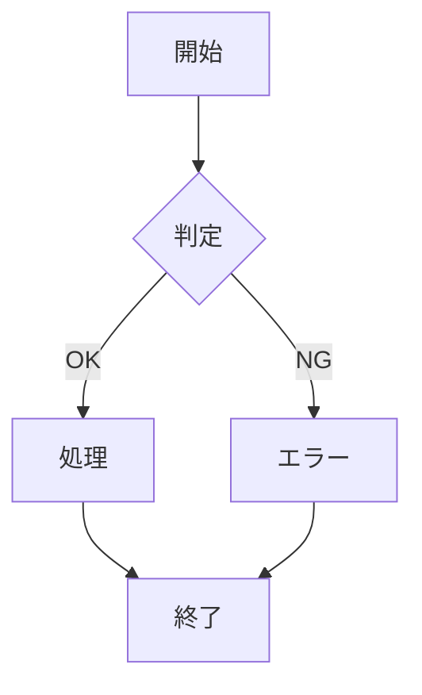
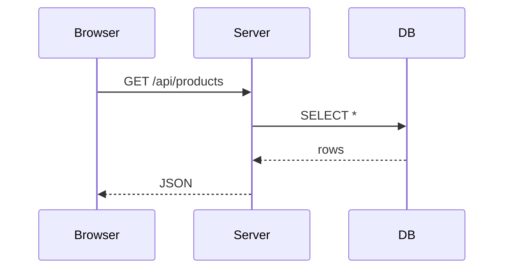
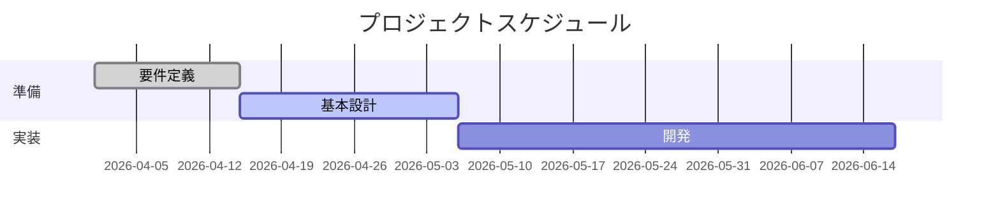
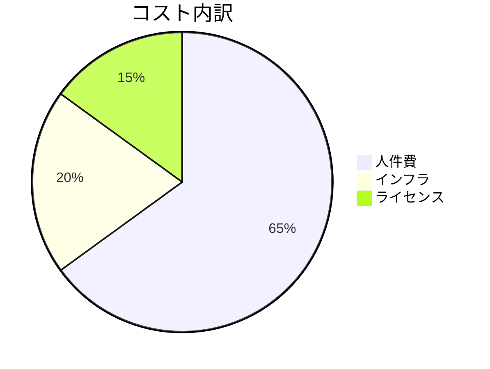
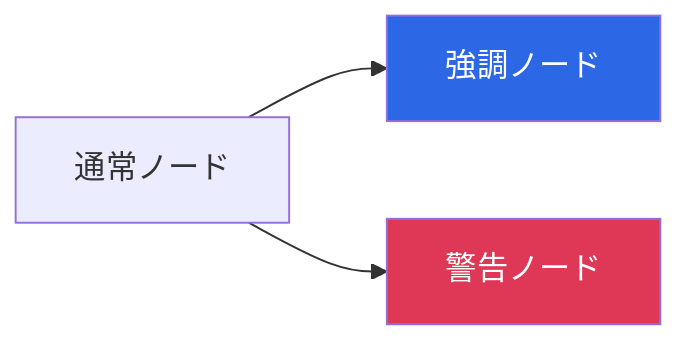

# 図解と画像の使い方

Marp + FJ テーマで図を扱うときの運用指針。Mermaid をまず書く → 必要に応じて画像化する、という 2 段階のワークフローが基本。

## 方針: まず Mermaid で書く

手書きの画像を貼る前に、まず Mermaid で構造を書く。理由:
- **保守しやすい** — テキストなので後から編集・差分が見える
- **情報が残る** — 他の人が図の意図を理解できる
- **自動で再生成できる** — ツールの出力に合わせてスタイルが統一される

Marp は Mermaid を直接描画しないので、用途に応じて描画手段を選ぶ:

| 出力 | 手段 | コマンド |
|------|------|----------|
| HTML (ブラウザ閲覧) | mermaid.js CDN を HTML に注入 | `build --format html --with-mermaid` |
| PPTX / PDF (配布) | Mermaid を PNG に変換してから埋め込む | `scripts.generate_images` |
| 両方揃えたい | 両方実行 | 上 2 つを順に実行 |

## Mermaid パターン集

### graph (フローチャート)

````markdown

````

方向は `TB`, `TD`, `LR`, `RL`, `BT` から選ぶ。レイアウトが縦に長すぎる場合は `LR` にすると横長になる (FJ の 16:9 画面に収まりやすい)。

### sequenceDiagram

````markdown

````

### Gantt

````markdown

````

### pie (円グラフ)

````markdown

````

### classDiagram / stateDiagram

詳細は Mermaid 公式 (https://mermaid.js.org/) を参照。

## 色を FJ のブランドに合わせる

Mermaid ブロック内で `style` を付けると特定ノードだけ色を変えられる:

````markdown

````

`#2C67E5` (青) と `#DF3756` (赤) は FJ のブランドカラー。強調したいノードだけに使うと資料全体の統一感が出る。

## Mermaid を画像化する (PPTX 配布時のみ)

HTML 配布なら `build --with-mermaid` でブラウザがレンダリングするので不要。**PPTX で図として埋めたい場合のみ** mermaid-cli (`mmdc`) を使う。

```bash
npm install -g @mermaid-js/mermaid-cli   # 初回のみ

PYTHONPATH=skills/ppt-creator uv run python -m scripts.generate_images \
  /path/to/output/my-deck/deck.md
```

スクリプトが deck 内の Mermaid ブロックを検出し、`assets/mermaid-<hash>.png` に書き出し、Markdown を `` に置換する。元ファイルは `deck.md.bak` にバックアップされる。`mmdc` が無い環境では WARNING を出して何もしない (正常終了)。

## 通常画像

実写や図版を使う場合は Marp の画像記法でサイズを指定する:

```markdown


```

プレースホルダが必要な段階では `https://placehold.jp/fafafa/2C67E5/600x400.png?text=Preview` のような URL を使えば、画像ファイルが無くてもビルドが通る。

## 図を使うべき / 使わないべき場面

**使うべき**:
- システム構成 / データフロー (graph)
- プロセス / ワークフロー (flowchart, sequenceDiagram)
- プロジェクト計画 (gantt)
- 状態遷移 (stateDiagram)

**使わないべき**:
- 単なる箇条書きを「図っぽく」する (情報が増えない)
- 5 ノード以下のシンプルな関係 (テキストで十分)
- 20 ノード以上の複雑な図 (スライドでは読めない — 別紙へ)

**1 枚に 1 図が目安**。複数の図を並べたくなったら、スライドを分割する。
