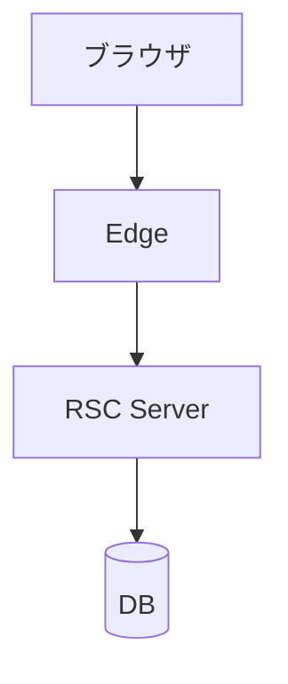
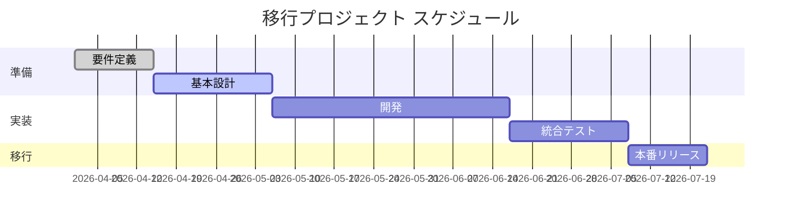

# レイアウトリファレンス

FJ Marp テーマのクラス語彙をベースに、**いつ・どう書くか** をスニペット付きで網羅したリファレンス。新しいデッキを書くときに迷ったらここを引く。

> 全クラスを 1 デッキで実演した動作確認用のサンプルは [`sample-slide.md`](sample-slide.md) を参照。

## 目次

| セクション | 内容 | 用途 |
|-----------|------|------|
| [全クラス早見表](#全クラス早見表) | 16 クラスの概要・用途・ページ番号 | クラス選定 |
| [ページネーション制御](#ページネーション制御) | `_paginate: false` / `skip` の使い分け | 表紙/章扉のページ番号制御 |
| [画像サイズの目安](#画像サイズの目安) | レイアウト別 `w:Xpx` の推奨値 + 向き判定 | 画像配置 |
| [スニペット集](#スニペット集) | 18 個の実例 (title, section, column, content-image, KPI 比較, blockquote, code, table, math, no-header 等) | 執筆中のコピペ元 |
| [レイアウト選びのフロー](#レイアウト選びのフロー) | 「何を見せたいか → 推奨クラス」の決定木 | 迷ったとき |
| [アンチパターン](#アンチパターン) | よくある失敗 7 種と回避策 | レビュー時 |
| [関連リファレンス](#関連リファレンス) | sample-slide.md / marp-advanced.md / images-and-diagrams.md / quality-checklist.md | 補完情報 |

## 全クラス早見表

| クラス | レイアウト概要 | いつ使うか | ページ番号 |
|--------|---------------|-----------|-----------|
| `title` | 表紙レイアウト (中央、グレー背景) | デッキの 1 枚目、表紙 | `_paginate: false` |
| `section` | 章扉 (左寄せ、中央寄り、グレー背景) | SCQA の各章の頭、論点の切り替え | `_paginate: false` |
| (指定なし) | h1 がヘッダーバー + 横線になる通常スライド | 9 割のスライド | true |
| `no-header` | ヘッダー帯を消してフルスクリーン | 大きな図・引用・キャッチコピー | true |
| `image` | タイトル + 画像のみ。画像は中央揃えで大きく | スクリーンショット主役、ダッシュボード見せ | true |
| `image image-shadow` | 上に加え、画像にドロップシャドウ | UI スクショ・写真の陰影付け | true |
| `content-image` | **タイトル → (画像 or テキスト) → テキストの縦積み** | **横長画像** (timeline / gantt / アーキ図) | true |
| `content-image-right` (+ `content-30..80`) | 左テキスト + 右画像の横並び。テキスト幅を 30〜80% で調整 | バランス型の図 + 説明 | true |
| `content-image-left` (+ `content-30..80`) | 左画像 + 右テキスト | 同上を逆向きに | true |
| `column-layout` + `<div class="column">` | 2〜3 カラム | KPI / Before-After / 候補比較 / 並列項目 | true |
| `align-center` | スライド全体を**縦中央**に寄せる | クロージング、結論の 1 行 | true |
| `all-text-center` | スライド内テキストを**横中央**に寄せる (タイトル除く) | 中央寄せメッセージ。`align-center` と併用が定番 | true |
| `text-center` / `h{1..6}-text-center` | 段落 / 特定見出しレベルだけ中央寄せ | 部分的な中央寄せ | true |
| `text-blue` / `all-text-blue` / `h{1..6}-text-blue` | 段落 / 全文 / 見出しを青色に | アクセント色追加 (見出し内 `**強調**` は自動で青) | true |
| `text-red` / `all-text-red` / `h{1..6}-text-red` | 同上の赤色版 | 警告・差分強調 | true |
| `small-text` | 全体のフォントサイズを **約 20% 縮小** | テーブルが大きい・情報密度が高いスライド | true |

**強調ルール**: 見出し内で `**強調**` で囲んだ部分は自動的に青色 (`#2C67E5`) になる。テキスト全体を青/赤にしたいときだけ `text-blue` / `text-red` 系クラスを使う。

## ページネーション制御

| 用途 | コメント |
|------|---------|
| 表紙でページ番号を消す | `<!-- _paginate: false -->` |
| 章扉でページ番号を消す | `<!-- _paginate: false -->` |
| カウント自体をスキップ (採番にも入れない) | `<!-- _paginate: skip -->` |

`title` / `section` クラスのスライドでは原則 `false` を指定する。

## 画像サイズの目安

1920×1080 / 92px パディングの FJ テーマでは、レイアウトに応じて画像幅を次のように合わせる。迷ったら `w:500px` から始めて、はみ出すなら小さく、余白が目立つなら大きくする。

| 用途 | 目安幅 |
|------|--------|
| 全面ヒーロー画像 (`image` 単独) | `w:800px` |
| 通常スライドのメイン図版 | `w:600〜700px` |
| `content-image` (縦積み) の下部に置く横長画像 | `w:1000〜1200px` |
| `content-image-right/left` + `content-60` の画像側 | `w:500px` |
| `content-image-*` + `content-70` の画像側 | `w:400px` |
| 2 枚並べるペア画像 | `w:400〜500px` 各 |
| 3 カラムのカード内ロゴ | `w:180〜220px` |

**テーマ側の保険**: `content-image-right/left` の画像は CSS で `max-width/max-height: 100%` + `object-fit: contain` が効いているので、`w:` 指定が画像領域を超えても自動で縮小される。ただし**極端な縦長/横長の画像は左右に空白ができる**ので、元画像のアスペクト比そのものを正すほうが見栄えが良い。

### Mermaid の向きに注意

`graph LR` + `subgraph` を複数並べると、Mermaid は subgraph を**縦に**積む (結果として縦長画像になる)。横に並べたい場合は次のどちらか:

- `graph TB` + 各 subgraph 内で `direction TB` + ノードを `-->` で連結 → 横並びの箱として描画
- `flowchart LR` のトップレベルで各ノードを横に並べ、subgraph を使わない

`content-image-*` に入れる図は **横長 (幅 > 高さ) が基本**。Mermaid を PNG 化する前に必ず `file <png>` でアスペクト比を確認する。

### 画像の向きに応じてレイアウトを選ぶ

画像のアスペクト比を見て、無理に `content-image-right/left` (横並び) に押し込まず、適切なクラスに切り替える。

| 画像の形 | 推奨クラス | 推奨幅 | 典型例 |
|---------|-----------|-------|--------|
| **極端に横長** (timeline / gantt / ロードマップ) | `content-image` (タイトル→テキスト→画像の縦積み) | `w:1000〜1200px` | Mermaid `timeline`, `gantt`, 年表 |
| **バランス型** (flowchart, graph TD) | `content-image-right/left` + `content-60` | `w:500〜600px` | 業務フロー、アーキ図 |
| **縦長** (層構造、スタック) | `content-image-right/left` + `content-40` (画像領域を広げる) | `w:400〜500px` | レイヤー図、スタック図 |
| **ほぼ正方形** | `content-image-right/left` + `content-60` | `w:500px` | 相関図、象限図 |

**時系列/ロードマップは `content-image` で中央下に広く配置する**ことを推奨。横並びに押し込むと文字が潰れて読めなくなる。

---

## スニペット集

### 表紙 (title)

```markdown
<!-- _class: title -->
<!-- _paginate: false -->


# プロジェクト名 **Phase2** 提案

20XX/XX/XX / 経営会議
提案責任者: 佐藤 太郎
```

**ポイント**: 上部にロゴを置き、h1 に提案タイトル、その下に日付と発表者。`_paginate: false` を必ず付ける。

### 章扉 (section)

```markdown
<!-- _class: section -->
<!-- _paginate: false -->

## 背景と課題
現状システムが抱える**3つのリスク**
```

**ポイント**: h2 で章名、その下に 1 文の補足。SCQA の S/C/Q/A 切り替え時に挟む。

### 通常スライド (h1 がヘッダーバーになる)

```markdown
# 現状の月間エラーは **前年比 2.5 倍** に増えている

- トランザクション量は**昨年比 180%** に拡大
- 障害 1 件あたりの復旧時間は平均 **4.2 時間**
- 運用チームの残業時間は月 **80 時間** を超える月が増加

> 「このままでは SLA 99.9% の維持が難しい」— インフラ責任者ヒアリング
```

**ポイント**: アクションタイトル (結論) を h1 に。本文は 5 〜 7 項目以内。最後に blockquote で現場の声を添えると説得力が増す。

### no-header (ヘッダーなしフルスクリーン)

```markdown
<!-- _class: no-header -->

# このまま進めて **本当に間に合うのか？**

経営層からの 1 つの問いに、本日答えを出します
```

**ポイント**: ヘッダー帯が消えるのでキャッチコピーや問いかけを大きく見せたいときに使う。

### KPI を 3 列で見せる (column-layout 3 列)

```markdown
<!-- _class: column-layout -->

<div class="column">

## 削減工数
# **50%**
月次運用工数
480h → 240h

</div>

<div class="column">

## 障害件数
# **-80%**
月次 P2 以上
15件 → 3件

</div>

<div class="column">

## コスト
# **¥1.2億**
3年 TCO 削減見込み

</div>
```

**ポイント**: 各カラムは「ラベル → 巨大な数字 → 補足」の 3 段構造。h1 で巨大な数字を出すのが視覚インパクトの肝。

### Before / After の対比 (column-layout 2 列)

```markdown
<!-- _class: column-layout -->

<div class="column">

## Before
- 月次運用 **480h**
- 障害 **15件/月**
- SLA **99.5%**

</div>

<div class="column">

## After
- 月次運用 **240h** (-50%)
- 障害 **3件/月** (-80%)
- SLA **99.9%** (+0.4pt)

</div>
```

**ポイント**: 同じ指標を同じ順序で並べる。差分 (`-50%` など) を After 側に必ず付記。

### card-grid: 4 個の同格カード (既定 2 列)

```markdown
<!-- _class: card-grid -->

# 4 フェーズで 17 週間、段階的にリスクを下げる

<div class="card">

## Phase 1 戦略
現状分析と方針決定 (**3 週間**)

</div>
<div class="card">

## Phase 2 設計
アーキ図と API 仕様 (**4 週間**)

</div>
<div class="card">

## Phase 3 実装
機能開発と結合 (**8 週間**)

</div>
<div class="card">

## Phase 4 検証
受入テストと本番切替 (**2 週間**)

</div>
```

**ポイント**: 4 個同格カードは既定 (cols-2) のまま 2x2 で並ぶ。各カードは `## 見出し` + 短い説明の 2 要素に揃えること — 要素数がカード間で揃わないと視覚的に崩れて見える。「**過去事故**: 6 個のカードを `column-layout` で 3 列 x 2 行に手動配置すると高さが揃わない。4 個以上の並列カードは必ず `card-grid` を使うこと。」

### card-grid cols-3: KPI や段階区分を 3 つ並べる

```markdown
<!-- _class: card-grid cols-3 -->

# 短期・中期・長期で投資規模を段階的に拡大する

<div class="card">

## 短期
# **50%**
運用工数の削減
480h → 240h

</div>
<div class="card">

## 中期
# **-80%**
障害件数
15件/月 → 3件/月

</div>
<div class="card">

## 長期
# **¥1.2億**
3 年 TCO 削減見込み

</div>
```

**ポイント**: KPI を 3 つ並べる時は `column-layout` でも動くが、`card-grid cols-3` の方が行高が CSS grid で自動的に揃うので**高さバラつきに悩まない**。迷ったら card-grid を選ぶ。

### card-grid cols-4: 4 指標のダッシュボード (短い数字とラベルだけ)

```markdown
<!-- _class: card-grid cols-4 -->

# 主要 4 指標は目標を全て達成している

<div class="card">

# **75%**
SWE-bench Verified

</div>
<div class="card">

# **89%**
GPQA Diamond

</div>
<div class="card">

# **2M**
コンテキスト長

</div>
<div class="card">

# **$2**
Input / 1M tok

</div>
```

**ポイント**: `cols-4` はカード幅が狭い (1 枚あたり約 400px)。本文を書くスペースは無い。**「# 大きな数字 + 1 行ラベル」だけに限定**すること。長めの説明を入れたい場合は `cols-3` に落とすか、2 枚に分ける。

### card-grid vs column-layout の使い分け早見表

| シチュエーション | 使うもの |
|------------------|----------|
| 4 個以上の**同格**アイテム (カード) | `card-grid` (必ず) |
| 2-3 個の**異質な文章ブロック** (左: 現状、右: 提案 など) | `column-layout` |
| KPI 数値 3 個 | どちらも OK、迷ったら `card-grid cols-3` |
| KPI 数値 4 個 | `card-grid cols-4` (必ず、column-layout 4 列は存在しない) |
| アイテム数が 5〜6 個 | `card-grid cols-3` (2 行) または `card-grid cols-2` (3 行) |
| アイテム数が 7〜8 個 | `card-grid cols-4` (2 行) |
| アイテム数が 9 個以上 | **スライドを分ける** (card-grid の CSS 上限は cols-2:8 / cols-3:9 / cols-4:12) |

### 文 + 図 (横並び・図が右、content-image-right + content-60)

````markdown
<!-- _class: content-image-right content-60 -->

# 新アーキテクチャは **3つの改善** を実現する

- **データ取得をコンポーネント単位**に分離
- **バンドル配信**を画面ごとに最適化
- **ストリーミング描画**で初期表示を短縮


````

**ポイント**: テキスト 60% : 画像 40% の比率。バランス型のフロー図やほぼ正方形の図に向く。

### 文 + 図 (横並び・図が左、content-image-left + content-60)

```markdown
<!-- _class: content-image-left content-60 -->

# **高リスク業務**でこそ多エージェントが効く


1. **複雑プログラミング**: ロジック / ドキュメント / 可読性を並列処理
2. **経営戦略分析**: 市場データ / 定量評価 / 反対論点
3. **学術リサーチ**: 文献調査 / 数式検証 / 仮説生成
```

**ポイント**: 左右を入れ替えたいだけなら `-right` → `-left` に置換。ストーリーで「結果は左、解説は右」を強調したいときに使う。

### 横長画像を中央下に広く配置 (content-image)

```markdown
<!-- _class: content-image -->

# xAI は **Colossus 2** で計算資源を独占しつつある

Memphis の **1GW Colossus 2** スーパークラスタで Grok 4.20 を運用中。3 年で **4 世代** を重ね、規模競争の土俵ではすでに **トップティア** に並ぶ。


```

**ポイント**: timeline / gantt / ロードマップなど**横長画像**はこのクラス。タイトル → 短い narrative → 大きな画像の縦積みになる。`w:1000〜1200px` でスライド幅いっぱいに広げる。

### 比較マトリクス (small-text + テーブル)

```markdown
<!-- _class: small-text -->

# 評価マトリクスでは **Snowflake** が最高得点

| 評価項目 | 重み | Snowflake | BigQuery | Redshift |
| --- | ---: | :---: | :---: | :---: |
| 3年 TCO | 30% | **¥8,200万** | ¥9,500万 | ¥7,800万 |
| クエリ応答 | 20% | **1.2秒** | 1.8秒 | 2.4秒 |
| 並列300 | 10% | **破綻なし** | 破綻なし | 一部遅延 |
| **総合** | 100% | **4.72** | 4.55 | 3.85 |
```

**ポイント**: 6 行以上 / 5 列以上のテーブルや、補足注記が多いスライドには `small-text` を当てる。lint の本文行数・文字数の閾値も 1.3 倍に緩和される。

### クロージング (align-center + all-text-center)

```markdown
<!-- _class: align-center all-text-center -->

# まとめ

# 段階移行で **12週 / LCP -68%** を達成可能

次アクション: 2026/04/20 までに PoC 計画書を提出
連絡先: example@example.com
```

**ポイント**: `align-center` (縦中央) + `all-text-center` (横中央) の併用が定番。h1 を 2 つ並べてキャッチコピーと結論を分けると視線の流れが作れる。

### 大きな問いかけ (no-header + all-text-center + align-center)

```markdown
<!-- _class: no-header all-text-center align-center -->

# このまま進めて
# 本当に **間に合うのか?**
```

**ポイント**: 章間に挟むと聴衆の集中を引き戻せる。SCQA の Question (Q) の 1 枚に最適。

### Mermaid Gantt (横長画像として content-image に置く)

````markdown
<!-- _class: content-image -->

# 実行計画は **3 フェーズ 16 週** で完遂する

PoC → 開発 → 本番リリースの 3 段階。各フェーズ末に Go/No-Go ゲートを置き、いつでも巻き戻せる体制で進める。


````

**ポイント**: gantt は横に長いので必ず `content-image` に入れる。HTML 出力時は `build --with-mermaid` で CDN 経由レンダリング、PPTX 出力時は事前に `mmdc` で PNG 化して置換する。

### blockquote でキーメッセージ

```markdown
# 現場からの声は **「運用の余白がない」** に収斂する

> 「障害対応が重なると本来やるべき改善タスクに手が回らない」
> — インフラチームリード

> 「毎月 20 時間以上を手動バッチの監視に使っている」
> — データ基盤運用担当
```

**ポイント**: 引用の末尾に `— 役職` を付けて発言者を明示。2 つ並べると課題の構造が見える。

### コードブロック (大きい場合は自動縮小)

````markdown
# Before — Pages Router のデータ取得は **ページ単位**

```ts
export async function getServerSideProps(ctx) {
  const user = await fetchUser(ctx.params.id);
  const posts = await fetchPosts(ctx.params.id);
  const comments = await fetchComments(ctx.params.id);
  return { props: { user, posts, comments } };
}
```

ページ全体で 1 つの `getServerSideProps` がすべてを取得する方式。
ある 1 つのコンポーネントが必要なデータでも、全部一緒に待つ必要があった。
````

**ポイント**: コードはコードブロック内で自動的にフォントサイズが調整される。実行例ではなく**設計上の差分**を見せる場合は数行に絞る。

### 画像主役 (image)

```markdown
<!-- _class: image -->

# ダッシュボードの変化は **一目瞭然**


```

**ポイント**: スクリーンショットを大きく見せたいときに使う。`image image-shadow` にすると影が付くので UI 系画像と相性が良い。

### 画像主役 (複数枚並べる)

```markdown
<!-- _class: image -->

# Before / After の差は **2 枚の画像で語れる**


```

**ポイント**: 横並びに 2 枚配置される。3 枚以上は `column-layout` を使う。

### 色アクセント (text-blue / text-red)

```markdown
<!-- _class: text-red -->

# **危険信号**: SLA 違反が **3 ヶ月連続**

このペースで増加すると、**第3四半期中にペナルティ条項に抵触**する見込み。
```

**ポイント**: 警告系には `text-red` (段落のみ赤) や `all-text-red` (全部赤) を使う。常用すると効果が薄れるので、本当に強調したい 1 〜 2 枚に限定する。

### 数式の表示 (KaTeX)

```markdown
# スループットの理論限界

リクエスト並列度を $n$、平均レイテンシを $L$ とすると、

$$
\text{Throughput}_{max} = \frac{n}{L}
$$

n を 2 倍にしてもキャッシュ競合があれば線形には伸びない。
```

**ポイント**: フロントマターに `math: katex` を追記しておくと VS Code の lint も通る。

### 折りたたみ (補足情報)

```markdown
# まとめ

主な学びは 3 点。詳細な手順は補足を参照。

<details>
<summary>詳細な検証手順</summary>

1. PoC 環境を `terraform apply` で起動
2. 1万リクエスト/秒の負荷をかける
3. p99 レイテンシが 200ms を超えないことを確認

</details>
```

**ポイント**: HTML 出力時のみ動作。PPTX では展開状態でレンダリングされる。

### スコープ付きカスタム CSS

```markdown
<style scoped>
.callout {
    background-color: #e3f2fd;
    border-left: 4px solid #2C67E5;
    padding: 16px;
    margin: 16px 0;
    border-radius: 4px;
}
</style>

# 1 枚だけ装飾を足したいときの最後の手段

<div class="callout">

**重要**: この設定は本番環境でのみ有効。
ステージング環境では <code>FEATURE_FLAG_X=false</code> のままにする。

</div>
```

**ポイント**: テーマで足りない装飾は `<style scoped>` で 1 枚に閉じ込める。多用しないこと (デッキ全体の統一感が崩れる)。

---

## レイアウト選びのフロー

```
そのスライドで「主役」は何か?
├── 結論メッセージ → align-center + all-text-center
├── 章の切替    → section
├── 数値 KPI    → column-layout 3 列 + 巨大な数字
├── 比較 (2項目)  → column-layout 2 列
├── 比較 (多数)  → small-text + テーブル
├── 図版
│   ├── 横長 (timeline / gantt) → content-image
│   ├── バランス型              → content-image-right + content-60
│   ├── スクショ主役            → image (or image-shadow)
│   └── 縦長                    → content-image-right + content-40
├── 引用・現場の声 → 通常スライド + blockquote
├── コード         → 通常スライド (コードブロックは自動縮小)
└── それ以外       → 通常スライド (h1 + 箇条書き)
```

## アンチパターン

| やってはいけない | 何が起きるか | 代わりにどうする |
|------------------|--------------|------------------|
| `content-image-right` に縦長画像を入れる | 画像が領域からはみ出すか、左右に大きな空白 | `content-image` に切り替えて中央下に広く置く |
| 同じレイアウトクラスを 3 枚以上連続使用 | 視覚的に単調になり聴衆が飽きる | レイアウトを 2 〜 3 種類でローテーション (lint で警告される) |
| アクションタイトルではなくトピックラベル (例: 「コスト分析」) | 見出しだけ読んでも結論が伝わらない | 結論を述べる文に書き換える (例: 「ツール A は 3 年 TCO で 30% 有利」) |
| 1 枚に箇条書きを 8 個以上 | 文字が小さくなりすぎて読めない | 2 枚に分割するか、`column-layout` 3 列に分散 |
| `text-red` を 5 枚以上に多用 | 強調が効かなくなる | 本当に重要な 1 〜 2 枚に限定 |
| 表紙以外で `_paginate: false` を多用 | ページ番号が飛んで聴衆が混乱 | `title` / `section` のみで使う |
| Mermaid を `content-image-right` に入れたまま PPTX 出力 | コードブロックがそのまま表示される | `mmdc` で PNG 化してから置換 (`generate_images.py` 参照) |

## 関連リファレンス

- [`sample-slide.md`](sample-slide.md) — 全クラスを 1 デッキで実演した動作確認用サンプル
- [`marp-advanced.md`](marp-advanced.md) — Marp ディレクティブ、画像記法 (`bg`, `split bg`, filter)、Mermaid 連携
- [`images-and-diagrams.md`](images-and-diagrams.md) — Mermaid パターン集と PPTX 用画像化フロー
- [`quality-checklist.md`](quality-checklist.md) — 100 点満点の品質ルブリック (Before/After 例つき)
