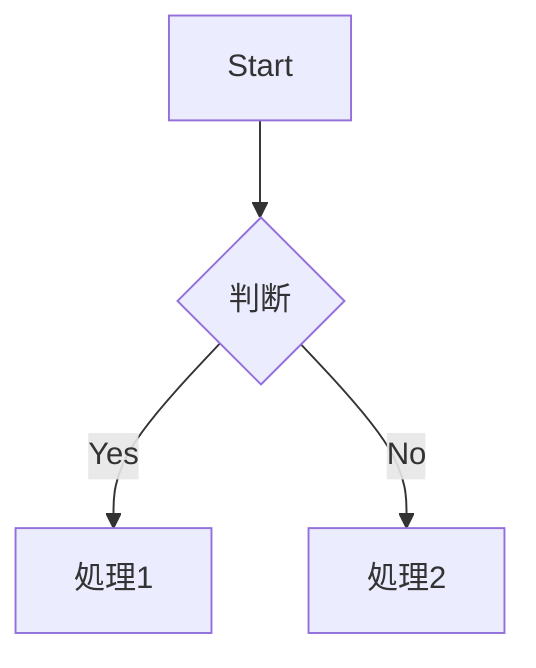

# Marp 高度機能リファレンス

Marp のディレクティブ、画像記法、スコープ付き CSS を活用するためのリファレンス。FJ テーマで頻繁に使うものに絞ってまとめる。

## フロントマター (Global Directives)

```yaml
---
marp: true
theme: fj
paginate: true                # ページ番号を表示
header: 'プロジェクト名'      # 全スライドに表示するヘッダー
footer: '© 2026 My Company'   # 全スライドに表示するフッター
size: 16:9                    # アスペクト比 (FJ は 1920×1080 既定)
title: デッキタイトル
description: [資料の説明（1〜2文）]
---
```

## スライド個別ディレクティブ (Local Directives)

`<!-- _name: value -->` で特定スライドだけに適用する。`_` プレフィックスが「ローカル」を意味する。

```markdown
<!-- _class: title -->
<!-- _paginate: false -->        # このスライドだけページ番号を消す
<!-- _header: '' -->             # このスライドだけヘッダーを消す
<!-- _backgroundColor: #eee -->  # このスライドだけ背景色を変える
```

## 画像の拡張記法 (Image Syntax)

Marp の画像記法は alt テキスト内にキーワードを書くことでサイズ・配置・フィルターを制御する。

### サイズ指定

```markdown
              # 幅 500px
              # 高さ 300px
      # 両方
                # 親要素の 50%
```

### 背景画像

```markdown
                  # 全面背景
            # 右半分に配置
        # 右から 40%
              # スライドに収める
            # 埋める (アスペクト比維持)
         # ぼかし
       # 透明度
```

### 複数背景 (スプリット)

```markdown


```

2 枚が左右に配置される。文字は全面に重なるので背景用の薄い色にすると良い。

### フィルター

```markdown


```

## スコープ付き CSS (`style` ディレクティブ)

フロントマターの `style:` でテーマを部分的に上書きできる。FJ の見た目を変えるのは極力避けるが、ロゴの差し替えなどに使う。

```markdown
---
marp: true
theme: fj
style: |
  section.title::before {
    background-image: url('assets/logo.svg');
  }
---
```

スライド内でもできる:

```markdown
<style scoped>
  h1 { letter-spacing: 0.05em; }
</style>

# このスライドだけ文字間隔を広げる
```

## ページ番号のスキップ

表紙・章扉ではページ番号を出したくないことが多い:

```markdown
<!-- _class: title -->
<!-- _paginate: false -->

# 表紙
```

## コメント (発表者ノート)

Marp では HTML コメントのうち、`_` で始まらないものは **発表者ノート** としてエクスポートされる (PPTX・HTML の話者ビュー)。

```markdown
# あるスライド

本文

<!-- この行は発表者ノートとして PowerPoint のノート欄に入る -->
```

クラス指定などの設定コメントは `<!-- _class: ... -->` のように `_` で始まるので、ノートには混入しない。

## 数式 (MathJax)

```markdown
$$ E = mc^2 $$

インライン: $a^2 + b^2 = c^2$
```

## コードブロックのシンタックスハイライト

```markdown
```typescript
const hello: string = 'world'
```
```

FJ テーマはフォントサイズを自動調整するので、行数が増えても収まる。10 行を超える場合はスクリーンショットにするか、コードを要約することを検討する。

## Mermaid ブロック

```markdown

```

- **HTML 出力**: `build --with-mermaid` でブラウザ側レンダリング
- **PPTX 出力**: `scripts.generate_images` で PNG 化してから埋め込む
- 詳細は `images-and-diagrams.md` 参照

## 参考資料

- Marpit Markdown: https://marpit.marp.app/markdown
- Image Syntax: https://marpit.marp.app/image-syntax
- Directives: https://marpit.marp.app/directives
- Theme CSS: https://marpit.marp.app/theme-css
